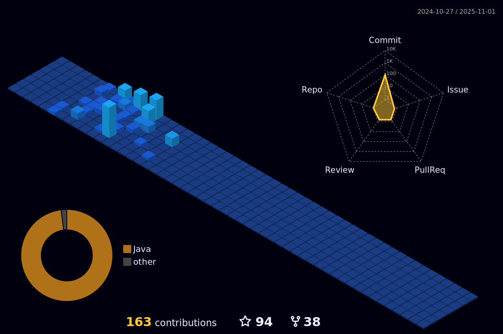

</img>

&nbsp;&nbsp;
&nbsp;&nbsp;
&nbsp;&nbsp;
&nbsp;&nbsp;
&nbsp;&nbsp;
&nbsp;&nbsp;

I am Software Engineer having experience in developing web applications using Java, C#, Spring Boot, .NET Core, Angular,
PostgreSQL, etc. Also interested in some trending technologies e.g. React, Microservices, NoSQL Database
Systems (MongoDB, Redis), Message Brokers (RabbitMQ, Kafka) and Distributed Systems.

I am passionate about software development and spend some free time for learning new technologies and developing some apps
by using these technologies. I like travelling, meeting new people, learning languages and new things; particularly
history, cuisine and culture.

 

### Technologies and Tools

 

### Stackoverflow Stats
[//]: # (&nbsp;&nbsp;&nbsp;[![StackOverflow]&#40;https://github-readme-stackoverflow.vercel.app/?userID=1604048&layout=compact&theme=dark&#41;]&#40;https://stackoverflow.com/users/1604048/murat-yıldız&#41;)

### GitHub Stats

  

